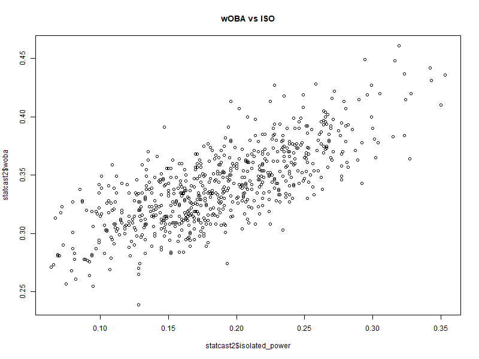

# Modeling Offensive Value in MLB Hitters

This project explores the statistical relationships between various offensive metrics and weighted On-Base Average (wOBA) to identify what best predicts a player's offensive value. Using a dataset of qualified MLB hitters and several regression models, we examined both individual metrics and interaction effects to determine the most informative predictors.

## Tools Used
- R (RStudio)
- MLB Statcast data
- Multiple Linear Regression & Model Comparison
- ANOVA, Residual Analysis, Interaction Terms

### Additional Report
A separate [Residual Analysis Report (PDF)](Residual%20Analysis%20Report.pdf) is included to evaluate model assumptions and fit.

## Project Notes

This project was developed as part of a group-based undergraduate statistical modeling course. Over the course of the project, we explored multiple modeling approaches to predict offensive value (wOBA), including:

- Models using ISO and OBP as main predictors
- Interaction terms between walk and contact-based variables
- A final diagnostic model using squared ISO and additional predictors

While the project did not result in a single "final" model, it reflects the full modeling workflow: exploratory analysis, variable testing, and assumption validation. It highlights both the complexity of model selection and the value of iterative, critical thinking in statistical modeling.

## Visual Highlights

### 1. Relationship Between ISO and wOBA

